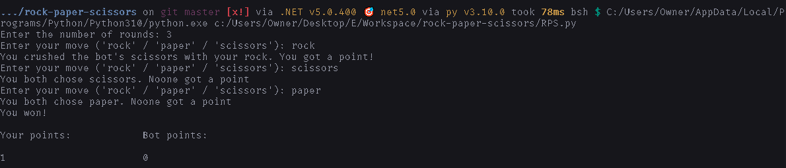

# How to run

There are 2 ways to play this game-:

## The easy way

1. Download `release.zip` from [the **latest** release](https://github.com/DhruvMitna/rock-paper-scissors/releases/latest).
2. Extract `release.zip` and run the `.exe` file inside it.

## The hard way

1. Install [python](python.org/downloads).
2. Download [`RPS.py`](https://raw.githubusercontent.com/DhruvMitna/rock-paper-scissors/master/RPS.py).
3. Open your downloads folder and open `RPS.py`.

### Examples

